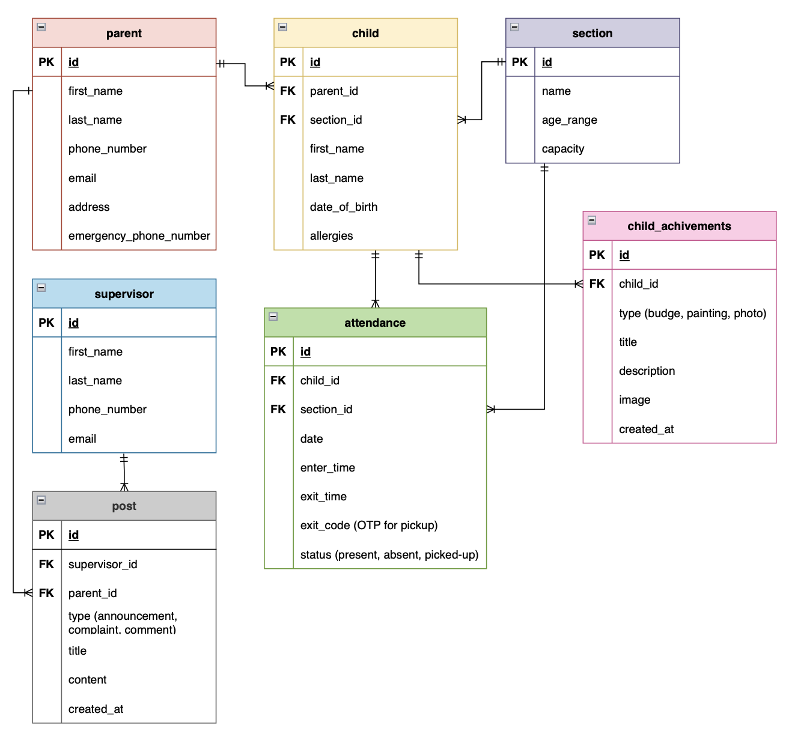
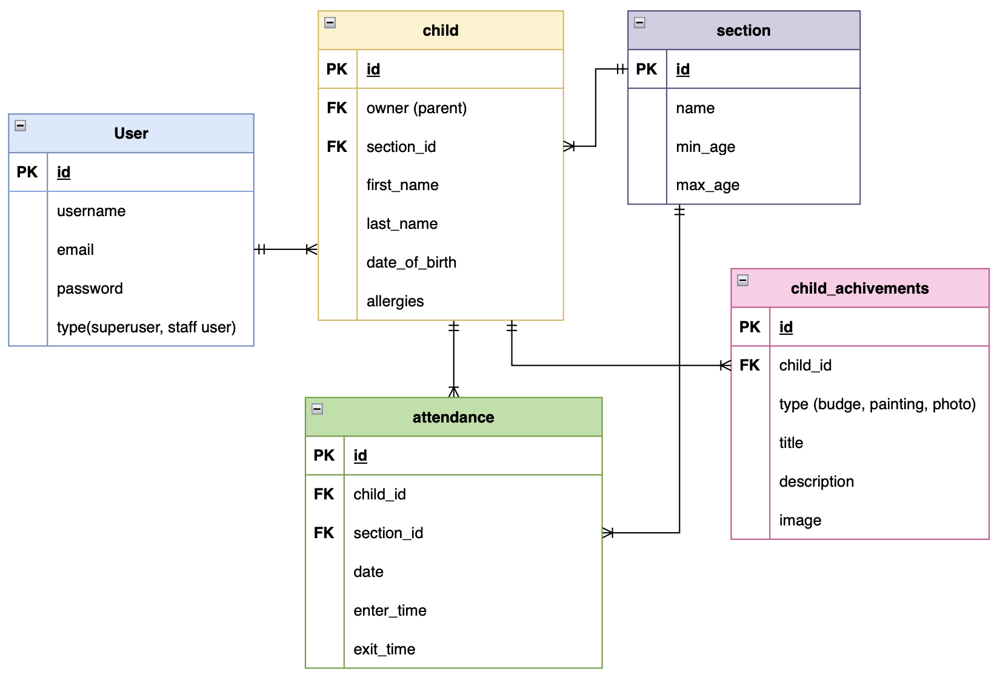

# CareNest Daycare

## Project Description

The CareNest Daycare Management System is a full-stack web application designed to organize daycare operations. Built with Django and Django REST Framework for the backend, it supports essential features such as user authentication, children management, attendance tracking, and manage child achievements. This backend API serves data to the React frontend, handling all logic, data validation, and permission controls.

## Backend Tech Stack

**Languages:**

* Python

**Frameworks & Tools:**

* Django
* Django REST Framework
* SimpleJWT (for JWT authentication)

**Database:**

* PostgreSQL

**Media Management:**

* Cloudinary (for image uploads)

**Testing & Debugging:**

* Postman

## Frontend Repository Link

[CareNest Frontend Repo](https://github.com/ghd1010/care-nest-frontend)

## ERD Diagram

Here was my ERD in the planning stage:

This is the updated ERD after development:

## Routing Table

| Route Name                                  | URL                                                 | HTTP Verb         | Description                                           |
|--------------------------------------------|-----------------------------------------------------|-------------------|-------------------------------------------------------|
| child-list-create                           | /children/                                          | GET / POST        | List all children or create a new child              |
| child-detail                                | /children/<int:pk>/                                 | GET / PUT / DELETE| Retrieve, update, or delete a child by ID            |
| get-achivements-by-child-id-delete-edit     | /children/<int:pk>/achievements/                    | GET               | Get achievements for a specific child                |
| achievements-list-create                    | /achievements/                                      | GET / POST        | List all achievements or create a new one            |
| achivements-detail                          | /achievements/<int:pk>/                             | GET / PATCH / DELETE | Retrieve, update, or delete an achievement       |
| attendance-edit                             | /attendance/<int:pk>/edit/                          | PATCH / DELETE    | Edit or delete attendance by ID                      |
| attendance-list                             | /attendance/                                        | GET               | List all attendance records                          |
| sections-list                               | /sections/                                          | GET               | List all daycare sections                            |
| attendance-by-section                       | /sections/<int:section_id>/attendance/              | GET               | View attendance records for a section                |
| attendance-create                           | /sections/<int:section_id>/attendance/add/          | POST              | Add attendance entry for a section                   |
| children-by-section                         | /sections/<int:section_id>/children/                | GET               | List children in a specific section                  |
| achievement-by-section                      | /sections/<int:section_id>/achievements/            | GET               | View achievements by section                         |
| token_obtain_pair                           | /token/                                             | POST              | Obtain JWT access and refresh tokens                 |
| token_refresh                                | /token/refresh/                                     | POST              | Refresh JWT access token                             |
| signup                                      | /signup/                                            | POST              | Register a new user                                  |
| user-details                                | /user_details/                                      | GET               | Get the current authenticated user's details         |
| all-parents                                 | /all_parents/                                       | GET               | Get a list of all parents                            |

## Getting Started / Code Installation

To set up the project locally, follow these steps:

### 1. Clone the Repository:

* **Backend:** `git clone https://git.generalassemb.ly/ghada001/care-nest-backend.git`

### 2. Backend Setup:

- `cd care-nest-backend`
- Create a Python Virtual Environment `pipenv shell`
- Install required dependancies:
    - `pipenv install django`
    - `pipenv install django djangorestframework psycopg2-binary`
- Migrations:
    - `python manage.py makemigrations`
    - `python manage.py migrate`
- Create a suoeruser, and run server:
    - `python manage.py createsuperuser` , to simplify type: `admin` => `admin@email.com` => `admin` => `y `
- To run the server:
    - `python manage.py runserver`

## Implementation Notes

* During the development process, I decided to **drop the `Post` model** due to time constraints.

* For user roles:

  * I initially planned to create separate `Parent` and `Supervisor` models using Django custom user models.
  * After researching and attempting to follow a tutorial, I faced complexity and frontend integration issues.
  * To simplify, I assigned **Supervisors** as Django `superusers`, and **Parents** are represented using the default built-in `User` model.

* The **exit code (OTP)** feature was also removed from the final version to meet project deadlines.

## IceBox Features

1. Implementing a customized user type
2. Add staff (employees that the supervisor can track too)
3. Add the `Post` model for communication between daycare and parents
4. Add the OTP code "Exit Code"
5. Add subscriptions and offers
6. Add food preferences for each child
7. Better UI/UX
8. Profile page for users
9. Parents can't Signup, because in real world, parent went first to the daycare, register their data there, and give them their acccounts. but I created the Sign up because its required to have a Signup page.
10. Add a summary content in the home component for each user.
